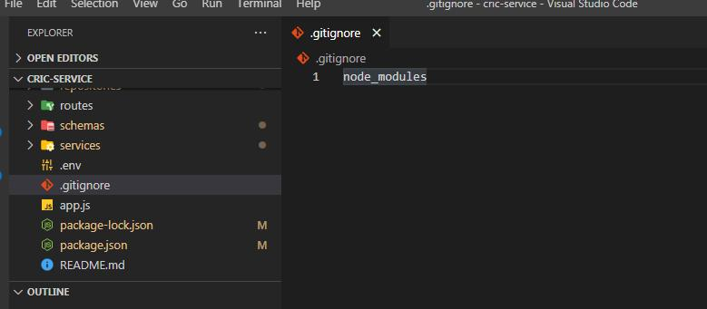
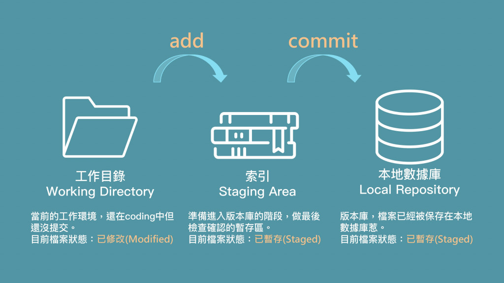
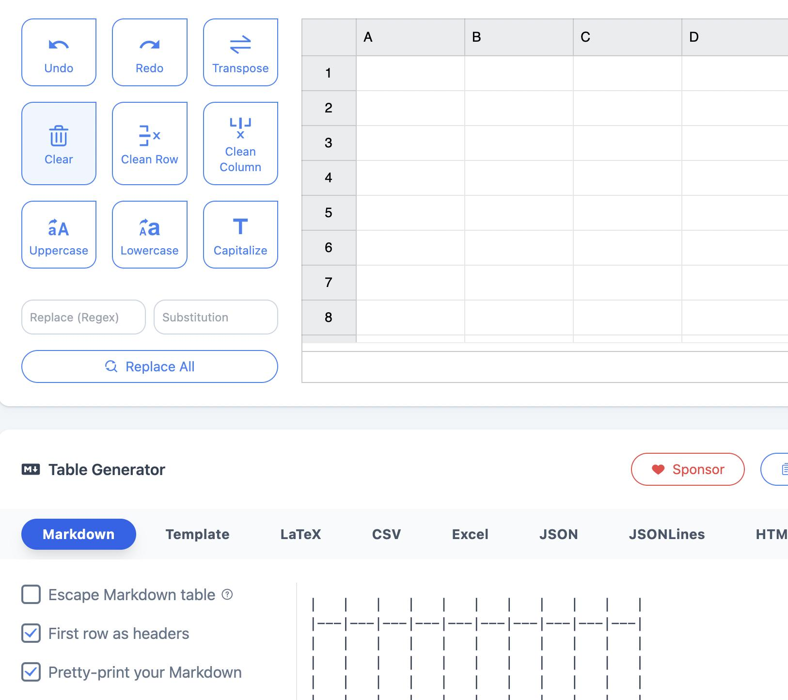
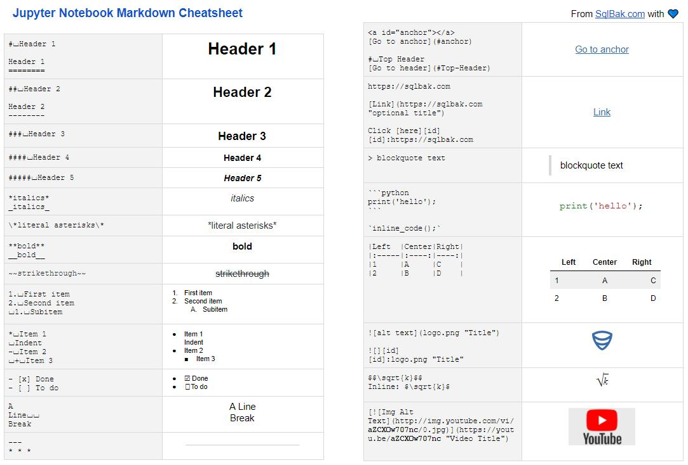
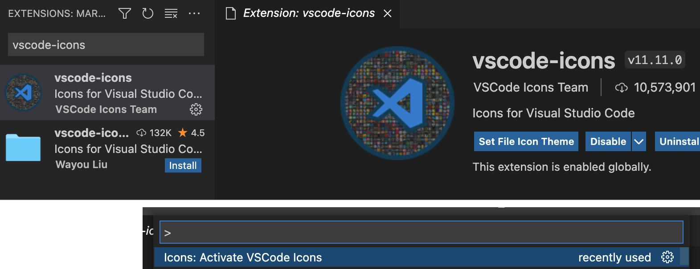
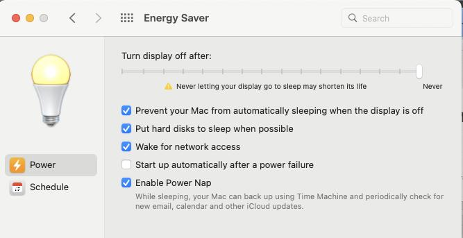
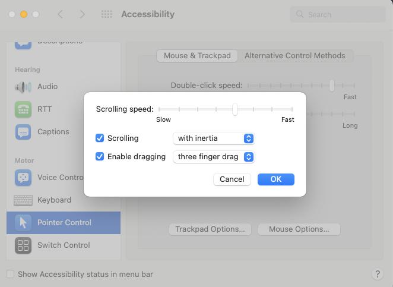
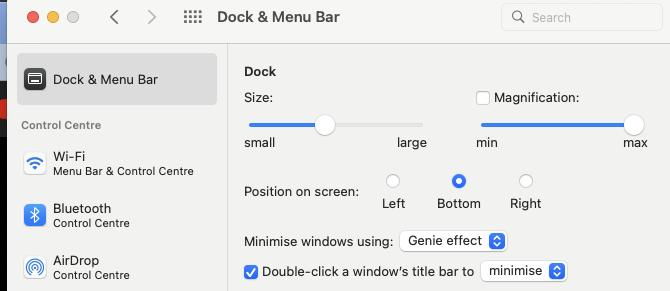
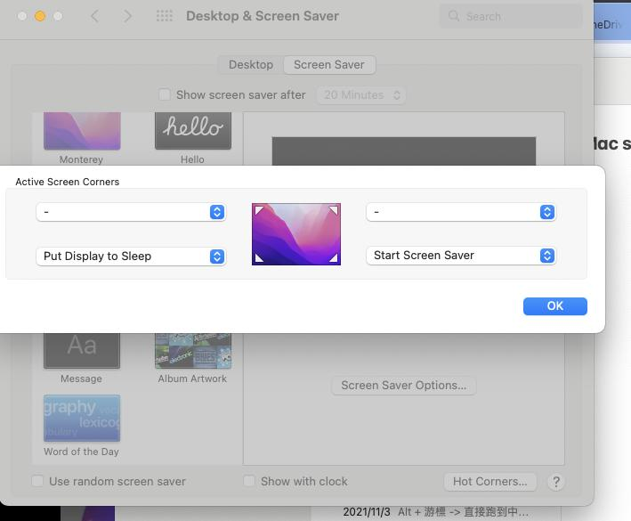

## ToC
---
- [terminal](#terminal)
    - [setup](#setup)
    - [shortcut](#shortcut)
    - [vim](#vim)
- [linux](#linux)
    - [ssh](#ssh)
    - [screen](#screen)
- [packages](#packages)
    - [homebrew](#homebrew)
    - [pip](#pip)
    - [node](#node)
    - [yarn](#yarn)
    - [express](#express)
- [git](#git)

- [mac](#mac)
    - [software](#Software)
    - [perference](#Perference)

- [editor](#editor)
    - [markdown](#markdown)
    - [jupyter](#jupyter)
    - [vscode](#vscode)
    - [os](#os)


- [python](#python)


### terminal 
---
#### setup
[iTerm2 installation](https://ithelp.ithome.com.tw/articles/10213796)

`defaults write com.apple.screencapture type jpg;killall SystemUIServer`
> [change screenshot file-type](https://free.com.tw/change-macos-screenshot-file-format/)


#### shortcut
> `Ctrl`+`U` 剪下游標 前方所有文字 並複製到暫存剪貼簿  
`Ctrl`+`K` 剪下游標 後方所有文字 並複製到暫存剪貼簿  
`Ctrl`+`Y` 由暫存剪貼簿貼上Ctrl+U與Ctrl+K剪下的文字  

> `Ctrl`+`W` 刪除游標前方的單字(Word)
`Ctrl`+`C` to cancel 中止執行中的命令
`Ctrl`+`L` 清除螢幕，同clear命令  

> `Alt + 游標`  直接跑到中間進行反白
`Ctrl`+`A`  游標移回開頭位置  
`Ctrl`+`E`  游標移回最後位置  

### vim 

> [命令模式] 刪除字元  
`x` 刪除游標所在的字元  
`dd` 刪除本行  

> [命令模式] 游標移動  
`:0` 移動到文件檔案的起點  
`:{number}` 移動到第 {number} 行  
`:$` 移動到文件檔案最後一行

> `gg` 頁面頂端  
`G` 頁面底端  

> `:q` 不儲存直接離開  
`:q!` 不儲存，強制直接離開（當有修改不想儲存時）  
`:e!` 放棄所有修改，從上次儲存文件紀錄開始編輯  
`:w` 儲存文檔但不離開  
`:!w` 強制儲存文檔但不離開  
`:w {name}` 儲存文檔並命名為 name，但不離開  
`:wq` 儲存並離開  
`:!wq` 強制儲存並離開  

> `i` 切換到插入模式，可以輸入字串文字內容  
`:` 切換到底線命令模式，可以在最底一行輸入操作指令  
`v` 切換到視覺模式，可以使用滑鼠游標選擇文字，方便閱讀和強調  
`x` 刪除游標所在字元

> [命令模式] 複製貼上  
`yy` 複製游標所在的那一行並放入暫存區  
`{n}yy` 複製游標所在的那一行往下數 {n} 行並放入暫存區  
`p` 複製暫存區的內容到游標所在下方  
`P` 複製暫存區的內容到游標所在上方

> [命令模式] 復原  
`u` 恢復之前的修改

> [底線命令模式] 搜尋取代  
`/{text}` 往前尋找 {text} 字串於檔案位置  
`[範圍] s/{from}/{to}/g` 在範圍（1, $ 代表全部檔案）中將 {from} 取代為 {to}，/g。 為全部取代。  
（例如： 1, 4 s/name/username/g 為將 1-4 行字串中所有 name 改為 username）

> 分頁指令  
`:tabe {檔案名稱}`  
`:tabe .`   
下一分頁  
`g t`  
`g T`  
關閉分頁指令  
`: close`  
`: clos`


### linux  
---
#### ssh

若含有空白建立檔案方式
`$touch 'my file'`
`$touch my\ file `


ssh -p 222 spock@140.114.XXX.XXX
scp -P 複製整個資料夾
scp -P 222 -r spock@140.114.135.53:/home/spock/trading_platform_nthu/server /Users/taiwanfifi/Desktop

#### screen

```python
$ screen
Attach: Ctrl+A+D
$ screen -ls (identify the name of the session)

$ screen -r <PID> (restore the session)
$ screen -S <PID>.<sessionName> -X sessionname <newSessionName>

$ screen -XS <session-id> quit  (close a session) 
Rationale: -X = Execute command, -S session PID to execute on
Example: screen -XS 20411 quit

```


### packages
---
#### homebrew
`apt-get` 是 Linux 上的一個重要的工具，很多軟件的安裝、卸載、更新都會用到它。Homebrew 就是 Mac 上的 `apt-get`。安裝 Homebrew 前先確認是否有安裝 Xcode 若有請先去更新它，因為 Homebrew 是用 Ruby 攥寫並且需要在有 Ruby 環境下使用，然而安裝 Xcode 時會自帶 Ruby 所以 Xcode 也要保持最新狀態。

- Home brew https://brew.sh/

- 指令 Install Homebrew  
```/usr/bin/ruby -e "$(curl -fsSL https://raw.githubusercontent.com/Homebrew/install/master/install)"  ```
- 若已經安裝過了檢查更新一下，保持最新狀態  
`brew update`  


convert .mov to .mp4  
`brew install ffmpeg`


#### pip 
`$ pip freeze > requirements.txt`  
`$ pip -r requirements.txt `

`$pip install opencv-python`

#### node
Add `node_modules/` or `node_modules` to the `.gitignore` file to ignore all directories called `node_modules` in the current folder and any subfolders like the below image.


br
初始化專案 `npm init -y` ， `-y` 就是省略一些提問快速初始化，或可以用 `npm init`


#### yarn
Yarn 是一個新的 package 管理器，它替代了 npm 客戶機或其他包管理器的現有工作流，同時保持與 npm 註冊表的兼容性。

> 運作模式  
1.解析(Resolution)：Yarn首先開始解析依賴包(package.json中的dependencies)然後向註冊表(暫存倉庫)發出請求，並遞迴查詢各層依賴。  
2.獲取(Fetching)：接下來，Yarn 會在一個全域的緩存目錄中查找當前所需的包是不是曾經已被下載過了如果還沒有，Yarn 會把這個包的壓縮包拉下來，並把它存放在全域緩存中(global cache)，這樣它下次就可以離線安裝了，無需重複下載。依賴包(package.json)也可以以 tarball 的形式存放到版本控制系統中，以實現完全的離線安裝。  
3.鏈接(Linking)：最後，Yarn 會把所需的所有文件從緩存中復製到本機的 node_modules 目錄中，這樣所有東西就鏈接為一個整體了。

- macOS user  
`brew install yarn`  
`brew upgrade yarn`  
- windows user  
`npm install yarn --g`  
`yarn --version`  


| 回傳值                                | 方法名稱                      | 說明                                |   |   |   |   |   |   |   |
|------------------------------------|---------------------------|-----------------------------------|---|---|---|---|---|---|---|
| npm install                        | yarn install              | 安裝 json.package 所有依賴              |   |   |   |   |   |   |   |
| npm install [package]              | (N/A)                     | Yarn不支援直接安裝套件                     |   |   |   |   |   |   |   |
| npm install --save [package]       | yarn add [paakage]        | 儲存在 json.package中的dependencies    |   |   |   |   |   |   |   |
| npm install --save-dev [package]   | yarn add [paakage] --dev  | 儲存在 json.package中的devDependencies |   |   |   |   |   |   |   |
| npm install --global [package]     | yarn global add [package] | 安裝在電腦全域中                          |   |   |   |   |   |   |   |
| npm uninstall [package]            | (N/A)                     | Yarn不支援直接安裝與移除套件                  |   |   |   |   |   |   |   |
| npm uninstall --save [package]     | yarn remove [package]     | 移除dependencies某套件                 |   |   |   |   |   |   |   |
| npm uninstall --save-dev [package] | yarn remove [package]     | 移除devDependencies某套件              |   |   |   |   |   |   |   |
| rm -rf node_modules && npm install | yarn upgrade              | 更新node_modules                    |   |   |   |   |   |   |   |


#### express
這個指令是 Express 的命令工具，他可以很方便的一鍵初始化整個專案，首先 npm install -g express-generator 安裝全域中。  
`npm install -g express-generator`  
`express --version`  

初始化建立專案，前端的部分有許多模板引擎，模板引擎（Template Engine）是一個將頁面模板和數據結合起來生成 HTML 的工具，有下列:  
--ejs  
--pug  
--hbs  
--hogan  

建立與初始化資料夾，後面的專案名稱可自行命名，若你未指定模板引擎會自動預設 jade 模板  
`express -f 專案名稱`

install package  
初始化完成後必須使用 `npm install` 或 `yarn install` 來安裝 package.json 內所指定的套件，要安裝什麼套件 express-generator 都自動幫你寫好了，由於這些模組都非常的大所以要透過指令去把他安裝回來，之後會產出一個叫 node_modules 的資料夾，總之你可以把 package.json 檔案想成是一個軟體清單，所有會用到的套件都會列在裡面。  


### git 

> 讓 Git 開始對這個目錄進行版本控制`git init`   
開新資料夾：`mkdir(Make Directory) 資料夾名稱`  
開新檔案：`touch 檔案名稱`  
刪除檔案：`rm 檔案名稱`  
     ( 輸入 `rm *.副檔名` 例如： `rm *.html`  
     ( `-r 參數`(recursive 遞迴刪除)  


>檢查狀態 `git status`  
加入索引 `git add .`  
提交更新 `git commit -m '修改記錄'`  
查詢記錄 `git log`  
忽略檔案 `touch .gitignore`
取消索引 `git reset HEAD`
還原檔案 `git checkout`

> 識別碼(前七碼)(雖然 reset 的英文是重新設定的意思，但在 Git 裡比較像是 「變成」或是「前往」的意思。)  
`git reset 識別碼`   
`git reset master^` 或是 `git reset HEAD^`
`git reset 版本紀錄的識別碼^`   (回溯前1次)  
`git reset 識別碼~6`   (回溯前6次)  

>  查詢到 reset 的檔案 `git log -g`
一覽 commit 的紀錄 `git log --oneline`

> 快速搜尋 commit 的檔案內容 `git log -S "commit 檔案的內容"`

> 修改過後的紀錄 `git diff `
不想刪掉檔案只是不想讓 Git 版控 `git rm --cached`

> 更改檔名 `git mv 舊檔名.副檔名 新檔名.副檔名  `
去做修改 -m 提供要修改的訊息  `git commit --amend -m ""  `

> 建立分支 `$ git branch -M main`  
將檔案推上遠端數據庫 ｜設定一個端節的節點 `$ git remote add origin https://github.com/taiwanfifi/OOOO`



> src  
 [Git與Github-30天學習歷程](https://ithelp.ithome.com.tw/articles/10213796)  
ssh-keygen [Setting Up SSH Keys for GitHub](https://www.youtube.com/watch?v=8X4u9sca3Io)


### editor
---
#### markdown 
[convert table to markdown](https://tableconvert.com/)：




#### jupyter
`brew install jupyter`




- src  https://sqlbak.com/blog/jupyter-notebook-markdown-cheatsheet

#### vscode

> 進入後按下 `command + shift + p` 輸入 path   
顯示 Shell Command: Install 'code' command in PATH  
之後在terminal輸入 `code .` 就會自動幫你把資料夾專案開啟  

> vscode-icons  
幫你 VS Code 檔案與資料夾 icon 美化  
vscode-icons 啟用  
 `command + shift + p` 輸入 icon 並點選`Icons: Activate VSCode Icons`



#### os

```py
import os, sys

path = "/tmp"

# 查看當前工作目錄
print(f"當前工作目錄{ os.getcwd() }")

# 修改當前工作目錄
os.chdir( path )

# 查看修改後的工作目錄
print(f"工作目錄修改後 { os.getcwd() }")

```


### Mac
---
#### software

- HandBrake: .mov -> mp4


#### perference

- Power saver


- Dragging


- Minimize


- Hot corner



### python 
---
解析 `if __name__ == '__main__'`的意義   

```py
# cool.py
def cool_func():
    print('cool_func(): Super Cool!')

print('__name__:', __name__)
print('Call it locally')
cool_func()

# other.py
from cool import cool_func

print('Call it remotely')
cool_func()
```
當你執行 other.py 時，你應該預期只會看到 Call it remotely 與 cool_func(): Super Cool! 兩段輸出，但實際上你看到的是：

```py
>> python other.py

Call it locally
cool_func(): Super Cool!
Call it remotely
cool_func(): Super Cool!
```

當執行other.py時，cool.py 中的主程式在被引用的時候也被執行了。當 Python 檔案(模組、module)被引用的時候，檔案內的每一行都會被 Python 直譯器讀取並執行(cool.py 內的程式碼會被執行)。  

```py
# cool.py

def cool_func():
    print('cool_func(): Super Cool!')

print('__name__:', __name__) # 新增顯示模組名稱
print('Call it locally')
cool_func()
```

Python 直譯器執行程式碼時，有一些內建、隱含的變數，`__name__`就是其中之一，其意義是「模組名稱」:  
該檔案是被引用，其值會是模組名稱 (`__name__ = cool`)
該檔案是(透過命令列)直接執行，其值會是 (`__name__ = __main__`)

```py
>> python cool.py

__name__: __main__
Call it locally
cool_func(): Super Cool!

>> python other.py

__name__: cool
Call it locally
cool_func(): Super Cool!
Call it remotely
cool_func(): Super Cool!
```

因此 __name__ 的值在檔案被直接執行時與被引用時是不同的。要讓檔案在被引用時，不該執行的程式碼不被執行，利用 __name__ == '__main__'做判斷。
```py
# cool.py

def cool_func():
    print('cool_func(): Super Cool!')

if __name__ == '__main__':
    print('Call it locally')
    cool_func()
```

```py
>> python cool.py

Call it locally
cool_func(): Super Cool!

>> python other.py

Call it remotely
cool_func(): Super Cool!
```

> src  
[Python - if __name__ == '__main__' 涵義](https://blog.castman.net/%E6%95%99%E5%AD%B8/2018/01/27/python-name-main.html)

