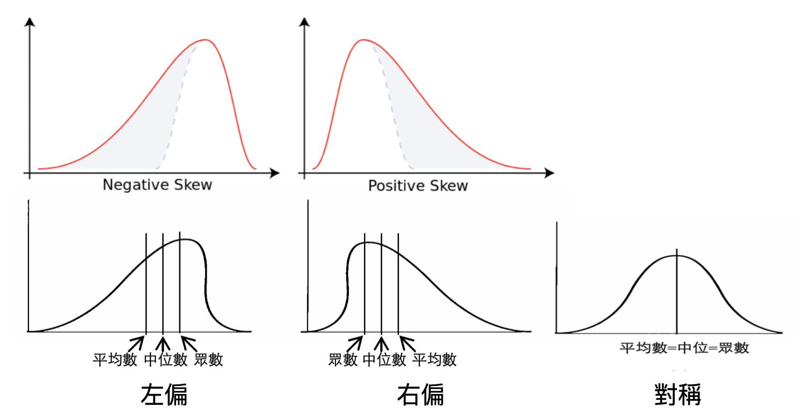

### ToC
---
- [function](#function)
- [def](#def)
    - [參數和引數](#參數和引數)
- [statistic](#statistic)
    - [變數](#變數)
    - [descriptive](#descriptive)
    - [有母數分析](#有母數分析)
    - [無母數分析](#無母數分析)
- [核密度估計](#核密度估計)

### function

$$ \sum_{n=1}^{\infty} 2^{-n} = 1 \$$
$\bar{X}$
$$f'(a) = \lim_{x \to a} \frac{f(x) - f(a)}{x-a}$$

$\int_a^b f(x) = F(b) - F(a)$

Col1 |Col2 |Col3
-----|-----|----- 
Data1|Data2|Data3
Data1|Data2|Data3
Data1|Data2|Data3
Data1|Data2|Data3

Left aligned column | Centered column | Right aligned column
:-------------------|:---------------:|--------------------:
**Bold data**       | *Italic data*   | Normal data

Left aligned column | Centered column | Right aligned column
:-|:-:|-:
**Bold data**|*Italic data*| Normal data


### def
---
#### 參數和引數
`Parameter` - A parameter is an intrinsic property of the procedure, included in its definition  
`Argument` - The arguments are the values actually supplied to the procedure when it is called  
參數是屬於函式定義的屬性，而引數是呼叫函式時提供給函式的實際數值。   

```c
int sumValue;
int value1 = 10;
int value2 = 20;

sumValue = sum(value1, value2);

int sum(int v1, int v2) {
    return v1 + v2;
}
```
函式 sum 有兩個參數, 個別為資料形態為 int 的 v1 與資料形態為 int 的 v2  
引數不是 value1 或 value2, 而是在呼叫 sum 這個函式時, 輸入的 value1 和 value2 那時的實際數值, 個別為指派給參數 v1 的 10 與指派給參數 v2 的 20


### statistic
---
資料收集, 資料處理與呈現, 資料特色與總結。以對資料作最符合目標的呈現
- 描述統計(descriptive statistics)：蒐集，整理，表現，分析與解釋資料
- 推論統計(inferential statistics)：如何將樣本取得的資料結果推廣到母體的過程。e.g. 信任區間、平均數的檢定、卡方、相關、迴歸。

	numerical data (quantitative variable)
    

#### 變數
---
 名目變數 Nominal
- 測量類別資料的變數 (例：血型)
- 特例：二分 dichotomous or binary – 只有兩個不同的值(例：性別)

次序變數 Ordinal
- 測量有重要，強弱，優劣之分的資料 (例：教育程度)
- 特例：排名Rank – 只考慮到觀察值在樣本中的相對位置

等距變數 Interval
- 測量的資料在不同個體上的數值差異是等值的資料 (例：攝氏氣溫) 
- 考試成績一般被認為是等距變數

比例變數 Ratio
- 等距尺度其最小值為0的資料，換言之，其數值的比例有意義 (例：身高、體重)


#### descriptive
---

- 算術平均數 Arithmetic Mean: 對每個觀察值的變化都有反應，但易受極端值的影響。

 - $\mu$代表母數
$$\mu = \frac{\Sigma^N_{i=1} X_i}{N}$$

 - $x$表示平均樣本
$$\overline{X} = \frac{x_1+x_2+...+x_n}{n} = \frac{1}{n}\Sigma x_i$$

- 中位數 Median: 若數值個數為奇數，則中位數為中央之數。若數值個數為偶數，則中位數為中央二數的平均; 極端值影響不大; 可進行無母數分析

- 眾數 Mode: 觀察值中出現最多的的數值或類別。

- 離散量數
 - 全距: (1) 最大值 - 最小值 (2) 全距越大表示分散程度越大  
 - 變異數與標準差Variance & standard deviation:變異數開根號就得到標準差; 變異數為0時，表示所有觀察值都同; 每個觀察值的變化都被考慮; 標準差與平均數有相同單位，可用來衡量觀察值與平均數的距離
$$ \sigma^2 = \frac{1}{N} \Sigma^N_{i=1}(X_i-\mu)^2 $$
$$ s^2 = \frac{1}{n-1}\Sigma^{n}_{i=1}(x_i-\overline{x})^2$$ 
 - 四分位數與四分位差: 四分位差IQR = Q3 – Q1
 - 百分位數

- 偏態: 偏態的方向描述是極端值方向; 負偏態（左）和正偏態（右）




>src  
[臺大初等統計學教學簡報範本](http://www.statedu.ntu.edu.tw:8080/zh_TW/function/2/2#gsc.tab=0) 


#### 有母數分析：
---
一般假設母群體為常態分布以進行檢定的方式，t 檢定、變異數分析、線性迴歸、Pearson相關係數等皆屬之。
母群體分布未知或不是常態分布，或是樣本數不夠大時皆可使用。是無母數分析方法的最大優點。

#### 無母數分析：
---

無法符合有母數分析所設計的方法；
常使用符號(正負)或排序(大小順序)取代測量數值，或使用各分類的次數以進行統計分析。
適用於類別、序位尺度資料分析與資料分布未知的情況。


- 無母數分析方法優點：
1. 母群體分布未知或不是常態分布，或是樣本數不夠大時皆可使用。是無母數分析方法的最大優點。
2. 計算簡單且快速。
3. 雖然在母群實際上為常態分配時，較有母數分析方法不易得到顯著結果；
4. 但在母群體不是常態分布時，無母數分析方法之檢力較有母數分析方法高。

- 無母數分析方法缺點：
1. 只使用資料的符號、排序等特性，浪費了數值之集中趨勢、分散性及分佈所提供的資訊。
2. 針對常態分布資料如果仍進行無母數分析，將使檢力降低。

當欲檢定的資料不符合有母數分析法之假設前提時才建議使用無母數分析法

> src [parametric method vs. nonparametric method](http://homepage.ntu.edu.tw/~clhsieh/biostatistic/10/10-1-1.html)


### 核密度估計
---
Kernel Density Estimation

長條圖轉換成折線圖有一個很大的定義落差，在於：

長條圖是離散型，每根長條有自己的定義，例如20-29歲有多少人、30-39歲有多少人…，但這已經把20~29歲的人看成是同一群人，同一群沒有年齡差異的人；但變成折線圖時並不是，折線圖是連續型的概念，它根據你給的20~29歲有多少人、30~39歲有多少人…，去「估計」每個連續數值：20歲有多少人、20.1歲有多少人、20.2歲有多少人(甚至切分到無窮個小數點)……進而去畫出連續不中斷的折線圖。


src: [白話解釋核密度估計](https://medium.com/qiubingcheng/%E7%99%BD%E8%A9%B1%E8%A7%A3%E9%87%8B%E6%A0%B8%E5%AF%86%E5%BA%A6%E4%BC%B0%E8%A8%88-kernel-density-estimation-18c4913f0b6a)
[什麼是【核密度估計(Kernel Density Estimation, KDE)】？](https://datama.com.tw/20191112b1/)


